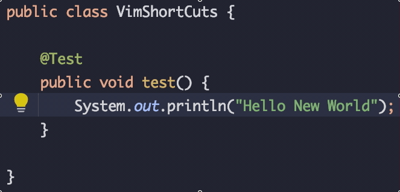

# Vim에서 사용하는 단축키를 알아보자
vim에서 자주 사용하는 단축키에 대해서 알아봅시다

## inner word
### ciw (change inner word)
커서 기준으로 한 단어를 삭제하고 입력 상태로 변경합니다

---
### diw (delete inner word)
커서 기준으로 한 단어를 삭제합니다.

---
### ciW / diW
커서를 기준으로 빈 공백 사이의 문자들을 삭제합니다.

## 복사 / 붙여넣기
맥 OS의 경우에는 command + c, v 를 이용해서 복사 붙여넣기가 가능하기 때문에 상관 없지만, 윈도우 환경에서는 단축기가 충돌난다.
이떄 ctrl + ins / shift + ins 로 대체할 수 있다.
